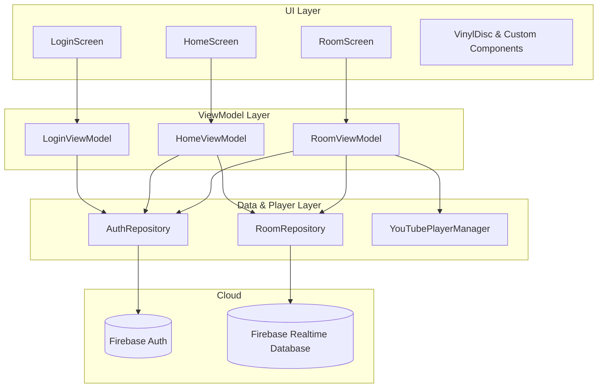

# DEMONIC 🎧🔥

> **Synchronized Social YouTube Player for Android**  
> Listen and watch YouTube together in millisecond real-time sync with host playback controls, live presence, and interactive room chat.

[](https://www.android.com)
[](https://kotlinlang.org)
[](https://developer.android.com/jetpack/compose)
[](#architecture)
[](https://firebase.google.com)
[-informational.svg?style=flat)](https://developer.android.com)

---

## ⚡ Highlights & Key Features

### 1. 🎵 Millisecond Playback Sync Engine
- **Host-Driven Precision:** Only the room host writes playback state (`playing` / `paused`), current position, and server timestamp to Firebase.
- **Server Timestamp Math:** Avoids client clock skew by using `ServerValue.TIMESTAMP` and `.info/serverTimeOffset`:
  $$\text{targetPosition} = \text{position} + \frac{\text{serverNow} - \text{updatedAt}}{1000.0}$$
- **8-Second Periodic Drift Monitoring:** Continuously compares local player second against calculated target position. If drift exceeds **1.5 seconds**, the client silently reseeks without pausing.
- **Host Integrity:** Host actions always commit to Firebase first; the host's own player only updates when the listener event fires back.

### 2. 💿 Cinematic Visuals & "DEMONIC" Dark Theme
- **Rotating Vinyl Disc Centerpiece:**
  - Visual grooved vinyl record with concentric canvas tracks, light reflection sheen, and center video thumbnail label.
  - Rotates smoothly while playing ($33\frac{1}{3}\text{ RPM}$ physics) and smoothly freezes on pause.
- **Pulsing "IN SYNC" Cyber Badge:**
  - Live animated aura showing real-time status and drift down to the millisecond.
- **Obsidian & Crimson Ember Styling:**
  - Deep near-black background (`#0A090D`) with glowing crimson accents (`#FF2A54`) and neon violet secondary highlights.
- **Tactile Feedback & Haptics:**
  - Spring-scale animations on button presses paired with Android system haptic vibrations.

### 3. 👥 Room Management & Sharing
- **6-Character Unique Room Codes:** Collision-checked code generation (e.g. `AB7X9K`).
- **Live Updating Member List:** Horizontal avatar list with host crown/star badge and animated staggered entrance.
- **1-Tap Share Sheet:** Shares the room code, description, and deep links (`demonic://room/{code}`).

### 4. 💬 Live Room Chat
- **Instant ChildEventListener Streams:** Append-only message delivery ordered by timestamp.
- **Distinct Chat Bubbles:** Crimson gradients for own messages vs obsidian cards for other listeners.
- **Animated 3-Dot Wave Typing Indicator:** Live "Someone is typing..." broadcast.
- **Smart Auto-Scroll:** Automatically scrolls down for new messages unless the user is actively scrolling history.

---

## 🏗️ Architecture

DEMONIC is designed with clean **MVVM (Model-View-ViewModel)** and **Repository** patterns:



---

## 📂 Project Structure

```
DEMONIC/
├── app/
│   ├── src/main/
│   │   ├── AndroidManifest.xml
│   │   ├── java/com/nddfeon/demonic/
│   │   │   ├── DemonicApp.kt               # Application entry point
│   │   │   ├── MainActivity.kt             # Navigation Compose & deep links
│   │   │   ├── data/
│   │   │   │   ├── model/
│   │   │   │   │   ├── Room.kt             # Room schema
│   │   │   │   │   ├── Member.kt           # Member schema
│   │   │   │   │   ├── ChatMessage.kt      # Chat message schema
│   │   │   │   │   └── UserAccount.kt      # User model
│   │   │   │   └── repository/
│   │   │   │       ├── AuthRepository.kt   # Google Auth flow & listener
│   │   │   │       └── RoomRepository.kt   # Firebase Realtime DB CRUD
│   │   │   ├── di/
│   │   │   │   └── AppModule.kt            # DI bindings & singletons
│   │   │   ├── player/
│   │   │   │   ├── YouTubePlayerManager.kt # IFrame player wrapper
│   │   │   │   └── YouTubeUrlParser.kt     # YouTube URL/ID parser
│   │   │   ├── ui/
│   │   │   │   ├── theme/                  # Colors, typography, DEMONICTheme
│   │   │   │   ├── components/             # VinylDisc, SyncBadge, Chat, Avatars
│   │   │   │   ├── login/                  # LoginScreen
│   │   │   │   ├── home/                   # HomeScreen
│   │   │   │   └── room/                   # RoomScreen
│   │   │   └── viewmodel/
│   │   │       ├── LoginViewModel.kt
│   │   │       ├── HomeViewModel.kt
│   │   │       └── RoomViewModel.kt
│   │   └── res/                            # Assets, strings, mipmaps
│   └── build.gradle.kts
├── docs/                                   # Detailed technical documentation
│   ├── ARCHITECTURE.md
│   ├── SYNC_ENGINE.md
│   ├── FIREBASE_SETUP.md
│   └── UI_AND_COMPONENTS.md
└── build.gradle.kts
```

---

## 🛠️ Tech Stack

- **Language:** Kotlin 2.2.10
- **UI Framework:** Jetpack Compose + Material3
- **Image Loading:** Coil Compose
- **YouTube Playback:** `com.pierfrancescosoffritti.androidyoutubeplayer:core:12.1.1`
- **Realtime Database:** Firebase Realtime Database
- **Authentication:** Firebase Authentication (Google Sign-In)
- **Asynchronous Flow:** Kotlin Coroutines & StateFlow
- **Testing:** JUnit4, AndroidX Test Runner

---

## 🚀 Getting Started

### Prerequisites
- Android Studio Ladybug / Meerkat or newer
- JDK 17 or higher
- Android SDK 36/37

### Building the App
```bash
# Clone the repository
git clone https://github.com/silentboy07/demonic.git
cd demonic

# Build debug APK
./gradlew assembleDebug

# Run unit tests
./gradlew testDebugUnitTest
```

The compiled APK will be located at:
`app/build/outputs/apk/debug/app-debug.apk`

---

## 🔧 Firebase Setup

To connect to your own Firebase project for live cloud synchronization:

1. Create a project in [Firebase Console](https://console.firebase.google.com).
2. Add an Android App with package `com.nddfeon.demonic`.
3. Add the debug SHA-1 fingerprint:
   ```
   18:2E:65:37:36:B6:81:1E:58:A1:A4:B5:E2:B5:87:CE:03:90:DF:6C
   ```
4. Enable **Authentication** $\rightarrow$ **Google Sign-In**.
5. Enable **Realtime Database** and set rules:
   ```json
   {
     "rules": {
       "rooms": {
         ".read": true,
         ".write": true
       }
     }
   }
   ```
6. Download `google-services.json` and replace `app/google-services.json`.

*(Full guide: [docs/FIREBASE_SETUP.md](docs/FIREBASE_SETUP.md))*

---

## 📄 License
This project is open-source and available under the [MIT License](LICENSE).
